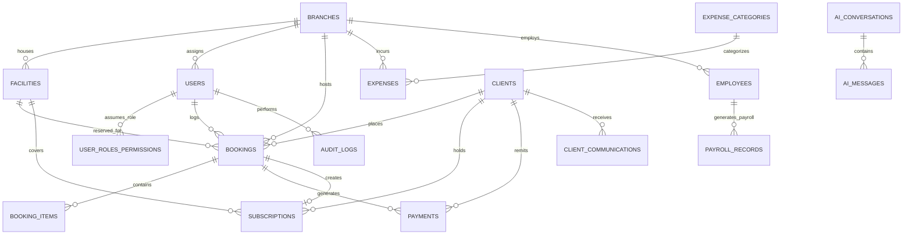

# DATABASE_ARCHITECTURE.md

**Project:** Workspace Management ERP
**Document Type:** Relational Database Architecture Specification
**Database Engine:** MySQL 8.0+ / MariaDB (utf8mb4_unicode_ci)
**Hosting Target:** Hostinger / cPanel / phpMyAdmin / Remote MySQL Instance

---

## 1. Executive Overview & Design Principles

This document defines the official **MySQL Database Architecture** for the Workspace Management ERP. The MySQL database serves as the single source of truth for all transactional, relational, administrative, and AI interaction data across the platform.

### Core Architecture Rules:
1. **Third Normal Form (3NF) Baseline**: All primary entities (`users`, `branches`, `facilities`, `clients`, `bookings`, `expenses`, `payments`, `employees`) are normalized in 3NF to avoid data duplication and update anomalies.
2. **Aggregated Intelligence via SQL Relational Queries**: High-level financial reporting, revenue trends, customer lifetime statistics, and facility occupancy rates are computed directly via SQL aggregation (`SUM()`, `COUNT()`, `JOIN`) rather than hardcoded client-side numbers.
3. **Decoupled Relational Keys & Business References**: Primary relational keys are indexed `VARCHAR` strings or auto-incrementing integers, accompanied by human-readable configuration-prefixed business codes (e.g., `BK-001`, `CL-001`, `EXP-001`).
4. **Referential Integrity & Safe Cascades**: Foreign keys (`FOREIGN KEY ... REFERENCES ...`) enforce data consistency across child records (`booking_items`, `client_communications`, `payroll_records`, `subscriptions`).
5. **Auditing & Timestamps**: Transactional records track `created_at` and `updated_at` timestamps for immutable auditability.

---

## 2. Comprehensive Entity Relationship Diagram (ERD)

---

## 3. Database Table Definitions

### 3.1 Authentication & User Management

#### `users`
* **Purpose**: Manages system users, authentication credentials, roles, and branch assignment.
* **Primary Key**: `id` (`VARCHAR(50)`)
* **Columns**:
  - `id` (`VARCHAR(50)`, NOT NULL): Unique user identifier (e.g. `USR-001`).
  - `name` (`VARCHAR(100)`, NOT NULL): User's full name.
  - `email` (`VARCHAR(150)`, NOT NULL, UNIQUE): Unique login email address.
  - `phone` (`VARCHAR(50)`, NULLABLE): Contact telephone number.
  - `password_hash` (`VARCHAR(255)`, NOT NULL): Bcrypt hashed authentication password.
  - `role` (`ENUM('Director','Manager','Receptionist','Accountant')`, NOT NULL, Default: `'Receptionist'`).
  - `branch_id` (`VARCHAR(50)`, NULLABLE): Relational FK to assigned `branches.id`.
  - `branch` (`VARCHAR(100)`, NOT NULL, Default: `'All Branches'`): Human-readable branch scope name.
  - `status` (`ENUM('Active','Inactive')`, NOT NULL, Default: `'Active'`).
  - `profile_photo` (`LONGTEXT`, NULLABLE): Avatar photo image URL or base64 payload.
  - `last_login` (`DATETIME`, NULLABLE): Timestamp of most recent user authentication session.
  - `created_at` (`DATETIME`, NOT NULL, Default: `CURRENT_TIMESTAMP`).
  - `updated_at` (`DATETIME`, NOT NULL, Default: `CURRENT_TIMESTAMP ON UPDATE`).

#### `user_roles_permissions`
* **Purpose**: Defines granular role-based access control (RBAC) permission vectors for each system role.
* **Primary Key**: `id` (`INT AUTO_INCREMENT`)
* **Columns**:
  - `id` (`INT`, NOT NULL, AUTO_INCREMENT).
  - `role` (`VARCHAR(50)`, NOT NULL, UNIQUE): System role name (`Director`, `Manager`, `Receptionist`, `Accountant`).
  - `permissions` (`JSON`, NOT NULL): JSON matrix mapping system sections (`dashboard`, `crm`, `expenses`, `reports`, `settings`, etc.) to boolean privilege states.
  - `updated_at` (`DATETIME`, NOT NULL).

---

### 3.2 System Administration & Business Settings

#### `business_settings`
* **Purpose**: Central persistent storage for organization metadata, tax rates, contact information, and prefix settings.
* **Primary Key**: `id` (`INT`, Default: `1`)
* **Columns**:
  - `id` (`INT`, NOT NULL, Default: `1`): Single-row configuration record.
  - `business_name` (`VARCHAR(150)`, NOT NULL).
  - `director_name` (`VARCHAR(100)`, NULLABLE).
  - `business_logo` (`LONGTEXT`, NULLABLE): Base64 or CDN URL for enterprise branding logo.
  - `currency` (`VARCHAR(50)`, NOT NULL, Default: `'USD ($)'`).
  - `timezone` (`VARCHAR(50)`, NOT NULL, Default: `'UTC'`).
  - `address` (`TEXT`, NULLABLE): Physical enterprise headquarters address.
  - `phone` (`VARCHAR(50)`, NULLABLE).
  - `email` (`VARCHAR(150)`, NULLABLE).
  - `website` (`VARCHAR(150)`, NULLABLE).
  - `language` (`VARCHAR(50)`, NOT NULL, Default: `'English (Default)'`).
  - `tax_rate` (`DECIMAL(5,2)`, NOT NULL, Default: `0.00`).
  - `invoice_prefix` (`VARCHAR(20)`, NOT NULL, Default: `'INV'`).
  - `booking_prefix` (`VARCHAR(20)`, NOT NULL, Default: `'BK'`).
  - `client_prefix` (`VARCHAR(20)`, NOT NULL, Default: `'CL'`).
  - `expense_prefix` (`VARCHAR(20)`, NOT NULL, Default: `'EXP'`).
  - `category_prefix` (`VARCHAR(20)`, NOT NULL, Default: `'EC'`).
  - `branch_code` (`VARCHAR(20)`, NOT NULL, Default: `'IPHIN'`).
  - `updated_at` (`DATETIME`, NOT NULL).

#### `profile_settings`
* **Purpose**: Individual administrator user profile overrides and personal preference state.
* **Primary Key**: `id` (`INT`, Default: `1`)
* **Columns**:
  - `id` (`INT`, NOT NULL, Default: `1`).
  - `user_id` (`VARCHAR(50)`, NULLABLE).
  - `full_name` (`VARCHAR(100)`, NOT NULL).
  - `email` (`VARCHAR(150)`, NOT NULL).
  - `phone` (`VARCHAR(50)`, NULLABLE).
  - `profile_photo` (`LONGTEXT`, NULLABLE).
  - `updated_at` (`DATETIME`, NOT NULL).

#### `branches`
* **Purpose**: Multi-location branch hubs operated by the enterprise.
* **Primary Key**: `id` (`VARCHAR(50)`)
* **Columns**:
  - `id` (`VARCHAR(50)`, NOT NULL): Unique branch key (e.g. `BR-001`).
  - `branch_code` (`VARCHAR(20)`, NULLABLE): Short prefix identifier.
  - `name` (`VARCHAR(100)`, NOT NULL): Official branch name (e.g. `Lekki Innovation Hub`).
  - `location` (`TEXT`, NULLABLE): Full physical address.
  - `state` (`VARCHAR(100)`, NULLABLE): State or province location.
  - `status` (`ENUM('Active','Inactive')`, Default: `'Active'`).
  - `created_date` (`DATE`, NOT NULL).
  - `created_at` (`DATETIME`, NOT NULL).
  - `updated_at` (`DATETIME`, NOT NULL).

#### `facilities`
* **Purpose**: Specific rentable workspace inventory units (desks, offices, podcast studios, boardrooms).
* **Primary Key**: `id` (`VARCHAR(50)`)
* **Foreign Keys**: `branch_id` -> `branches.id` (ON DELETE CASCADE)
* **Columns**:
  - `id` (`VARCHAR(50)`, NOT NULL): Unique facility key (e.g. `FAC-001`).
  - `name` (`VARCHAR(100)`, NOT NULL): Name of workspace facility.
  - `branch_id` (`VARCHAR(50)`, NOT NULL): FK referencing `branches.id`.
  - `branch_name` (`VARCHAR(100)`, NOT NULL): Denormalized branch display name.
  - `default_price` (`DECIMAL(12,2)`, NOT NULL, Default: `0.00`).
  - `capacity` (`INT`, NOT NULL, Default: `5`): Maximum seating/occupancy threshold.
  - `status` (`ENUM('Active','Inactive')`, Default: `'Active'`).
  - `description` (`TEXT`, NULLABLE).
  - `created_date` (`DATE`, NOT NULL).
  - `created_at` (`DATETIME`, NOT NULL).
  - `updated_at` (`DATETIME`, NOT NULL).

#### `expense_categories`
* **Purpose**: General ledger expense classification taxonomy.
* **Primary Key**: `id` (`VARCHAR(50)`)
* **Columns**:
  - `id` (`VARCHAR(50)`, NOT NULL): e.g. `CAT-001`.
  - `category_ref` (`VARCHAR(50)`, NULLABLE).
  - `name` (`VARCHAR(100)`, NOT NULL, UNIQUE): Unique expense category title.
  - `description` (`TEXT`, NULLABLE).
  - `status` (`ENUM('Active','Inactive')`, Default: `'Active'`).
  - `created_date` (`DATE`, NOT NULL).
  - `created_at` (`DATETIME`, NOT NULL).
  - `updated_at` (`DATETIME`, NOT NULL).

---

### 3.3 CRM & Customer Management

#### `clients`
* **Purpose**: Customer accounts, contact details, and status classification.
* **Primary Key**: `id` (`VARCHAR(50)`)
* **Columns**:
  - `id` (`VARCHAR(50)`, NOT NULL): e.g. `CL-IPHIN-1`.
  - `client_ref` (`VARCHAR(50)`, NULLABLE): Configurable prefix business reference.
  - `name` (`VARCHAR(150)`, NOT NULL): Individual or corporate entity name.
  - `phone` (`VARCHAR(50)`, NOT NULL).
  - `email` (`VARCHAR(150)`, NULLABLE).
  - `company` (`VARCHAR(150)`, NULLABLE).
  - `status` (`ENUM('Active','Inactive','VIP','Expiring Soon','Expired')`, Default: `'Active'`).
  - `created_at` (`DATETIME`, NOT NULL).
  - `updated_at` (`DATETIME`, NOT NULL).

#### `client_communications`
* **Purpose**: Logs interactions, phone calls, meetings, emails, and notes with clients.
* **Primary Key**: `id` (`INT AUTO_INCREMENT`)
* **Foreign Keys**: `client_id` -> `clients.id` (ON DELETE CASCADE)
* **Columns**:
  - `id` (`INT`, AUTO_INCREMENT).
  - `client_id` (`VARCHAR(50)`, NOT NULL): FK referencing `clients.id`.
  - `user_id` (`VARCHAR(50)`, NULLABLE): FK referencing `users.id`.
  - `type` (`ENUM('Email','SMS','Call','Meeting','Note')`, Default: `'Note'`).
  - `subject` (`VARCHAR(255)`, NULLABLE).
  - `summary` (`TEXT`, NOT NULL): Detailed content of the communication.
  - `direction` (`ENUM('Inbound','Outbound')`, Default: `'Outbound'`).
  - `status` (`VARCHAR(50)`, Default: `'Logged'`).
  - `logged_by` (`VARCHAR(100)`, NULLABLE): Name of staff member logging the record.
  - `sent_date` (`DATETIME`, NOT NULL).
  - `created_at` (`DATETIME`, NOT NULL).

---

### 3.4 Operations & Daily Logger

#### `bookings`
* **Purpose**: Primary transactional log recording workspace space allocations, pricing, durations, and status.
* **Primary Key**: `id` (`VARCHAR(50)`)
* **Foreign Keys**: `client_id` -> `clients.id` (ON DELETE CASCADE)
* **Columns**:
  - `id` (`VARCHAR(50)`, NOT NULL): Unique booking identifier (e.g. `BK-IPHIN-2026-1`).
  - `booking_ref` (`VARCHAR(50)`, NULLABLE): Human-readable business booking reference.
  - `date` (`DATE`, NOT NULL): Date of booking creation or execution start.
  - `start_time` (`TIME`, Default: `'09:00:00'`).
  - `end_time` (`TIME`, Default: `'17:00:00'`).
  - `client_id` (`VARCHAR(50)`, NOT NULL): Relational FK to `clients.id`.
  - `client_name` (`VARCHAR(150)`, NOT NULL).
  - `phone` (`VARCHAR(50)`, NOT NULL).
  - `email` (`VARCHAR(150)`, NULLABLE).
  - `branch_id` (`VARCHAR(50)`, NULLABLE).
  - `branch` (`VARCHAR(100)`, NOT NULL).
  - `facility_id` (`VARCHAR(50)`, NULLABLE).
  - `facility` (`VARCHAR(100)`, NOT NULL).
  - `days_count` (`INT`, NOT NULL, Default: `1`).
  - `time_duration` (`VARCHAR(100)`, Default: `'09:00 AM - 05:00 PM'`).
  - `amount` (`DECIMAL(12,2)`, NOT NULL, Default: `0.00`).
  - `payment_method` (`ENUM('Cash','Wire Transfer','Credit Card','Corporate Billing','POS Terminal')`, Default: `'Wire Transfer'`).
  - `days_used` (`INT`, NOT NULL, Default: `0`).
  - `days_left` (`INT`, NOT NULL, Default: `0`).
  - `status` (`ENUM('Active','Upcoming','Expired','Cancelled')`, Default: `'Active'`).
  - `created_by` (`VARCHAR(50)`, NULLABLE): Relational FK to `users.id`.
  - `created_at` (`DATETIME`, NOT NULL).
  - `updated_at` (`DATETIME`, NOT NULL).

#### `booking_items`
* **Purpose**: Line-item breakdowns for itemized booking receipts and invoices.
* **Primary Key**: `id` (`INT AUTO_INCREMENT`)
* **Foreign Keys**: `booking_id` -> `bookings.id` (ON DELETE CASCADE)
* **Columns**:
  - `id` (`INT`, AUTO_INCREMENT).
  - `booking_id` (`VARCHAR(50)`, NOT NULL): FK referencing `bookings.id`.
  - `item_name` (`VARCHAR(150)`, NOT NULL).
  - `unit_price` (`DECIMAL(12,2)`, NOT NULL).
  - `quantity` (`INT`, NOT NULL, Default: `1`).
  - `total_price` (`DECIMAL(12,2)`, NOT NULL).

#### `subscriptions`
* **Purpose**: Active pass and recurring subscription contract tracking.
* **Primary Key**: `id` (`VARCHAR(50)`)
* **Foreign Keys**: `client_id` -> `clients.id` (ON DELETE CASCADE)
* **Columns**:
  - `id` (`VARCHAR(50)`, NOT NULL): e.g. `SUB-001`.
  - `booking_id` (`VARCHAR(50)`, NULLABLE): FK referencing originating `bookings.id`.
  - `client_id` (`VARCHAR(50)`, NOT NULL): FK referencing `clients.id`.
  - `facility_id` (`VARCHAR(50)`, NULLABLE).
  - `facility_name` (`VARCHAR(100)`, NULLABLE).
  - `branch_id` (`VARCHAR(50)`, NULLABLE).
  - `branch_name` (`VARCHAR(100)`, NULLABLE).
  - `start_date` (`DATE`, NOT NULL).
  - `end_date` (`DATE`, NOT NULL).
  - `days_count` (`INT`, NOT NULL, Default: `30`).
  - `days_used` (`INT`, NOT NULL, Default: `0`).
  - `days_remaining` (`INT`, NOT NULL, Default: `30`).
  - `amount` (`DECIMAL(12,2)`, NOT NULL, Default: `0.00`).
  - `payment_method` (`VARCHAR(50)`, Default: `'Credit Card'`).
  - `status` (`ENUM('Active','Expiring Soon','Expired','Cancelled')`, Default: `'Active'`).
  - `created_at` (`DATETIME`, NOT NULL).
  - `updated_at` (`DATETIME`, NOT NULL).

---

### 3.5 Finance, Payments & Expenses

#### `expenses`
* **Purpose**: Operational costs, overheads, and vendor payments.
* **Primary Key**: `id` (`VARCHAR(50)`)
* **Columns**:
  - `id` (`VARCHAR(50)`, NOT NULL): e.g. `EXP-2026-001`.
  - `expense_ref` (`VARCHAR(50)`, NULLABLE).
  - `name` (`VARCHAR(200)`, NOT NULL): Expense title / line item name.
  - `amount` (`DECIMAL(12,2)`, NOT NULL).
  - `date` (`DATE`, NOT NULL).
  - `branch_id` (`VARCHAR(50)`, NULLABLE).
  - `branch` (`VARCHAR(100)`, NOT NULL).
  - `category_id` (`VARCHAR(50)`, NULLABLE).
  - `category` (`VARCHAR(100)`, NOT NULL).
  - `description` (`TEXT`, NULLABLE).
  - `status` (`ENUM('Paid','Approved','Pending','Rejected')`, Default: `'Paid'`).
  - `created_by` (`VARCHAR(100)`, Default: `'System Admin'`).
  - `created_at` (`DATETIME`, NOT NULL).
  - `updated_at` (`DATETIME`, NOT NULL).

#### `payments`
* **Purpose**: Financial settlement entries verifying incoming payments from clients.
* **Primary Key**: `id` (`VARCHAR(50)`)
* **Foreign Keys**: `client_id` -> `clients.id` (ON DELETE CASCADE)
* **Columns**:
  - `id` (`VARCHAR(50)`, NOT NULL): e.g. `PAY-001`.
  - `reference` (`VARCHAR(100)`, NOT NULL, UNIQUE): Unique payment reference transaction code.
  - `booking_id` (`VARCHAR(50)`, NULLABLE): Relational link to `bookings.id`.
  - `client_id` (`VARCHAR(50)`, NOT NULL): Relational link to `clients.id`.
  - `amount` (`DECIMAL(12,2)`, NOT NULL).
  - `payment_method` (`VARCHAR(50)`, NOT NULL).
  - `payment_date` (`DATE`, NOT NULL).
  - `status` (`ENUM('Completed','Pending','Failed','Refunded')`, Default: `'Completed'`).
  - `created_at` (`DATETIME`, NOT NULL).

---

### 3.6 HR & Payroll Module Foundation

#### `employees`
* **Purpose**: Enterprise staff directory and employment details foundation.
* **Primary Key**: `id` (`VARCHAR(50)`)
* **Columns**:
  - `id` (`VARCHAR(50)`, NOT NULL): e.g. `EMP-001`.
  - `user_id` (`VARCHAR(50)`, NULLABLE): Link to system user account if applicable.
  - `first_name` (`VARCHAR(100)`, NOT NULL).
  - `last_name` (`VARCHAR(100)`, NOT NULL).
  - `email` (`VARCHAR(150)`, NULLABLE).
  - `phone` (`VARCHAR(50)`, NULLABLE).
  - `department` (`VARCHAR(100)`, Default: `'Operations'`).
  - `position` (`VARCHAR(100)`, Default: `'Staff'`).
  - `branch_id` (`VARCHAR(50)`, NULLABLE).
  - `branch_name` (`VARCHAR(100)`, Default: `'Main Branch'`).
  - `hire_date` (`DATE`, NULLABLE).
  - `employment_status` (`ENUM('Full-time','Part-time','Contract','Inactive')`, Default: `'Full-time'`).
  - `salary_amount` (`DECIMAL(12,2)`, Default: `0.00`).
  - `created_at` (`DATETIME`, NOT NULL).
  - `updated_at` (`DATETIME`, NOT NULL).

#### `payroll_records`
* **Purpose**: Monthly payroll disbursement logs for enterprise employees.
* **Primary Key**: `id` (`VARCHAR(50)`)
* **Foreign Keys**: `employee_id` -> `employees.id` (ON DELETE CASCADE)
* **Columns**:
  - `id` (`VARCHAR(50)`, NOT NULL): e.g. `PAYROLL-001`.
  - `employee_id` (`VARCHAR(50)`, NOT NULL): FK referencing `employees.id`.
  - `period_start` (`DATE`, NOT NULL).
  - `period_end` (`DATE`, NOT NULL).
  - `gross_salary` (`DECIMAL(12,2)`, Default: `0.00`).
  - `deductions` (`DECIMAL(12,2)`, Default: `0.00`).
  - `net_salary` (`DECIMAL(12,2)`, Default: `0.00`).
  - `payment_status` (`ENUM('Pending','Paid','Processing')`, Default: `'Pending'`).
  - `payment_date` (`DATE`, NULLABLE).
  - `created_at` (`DATETIME`, NOT NULL).

---

### 3.7 AI Assistant, System Auditing & File Uploads

#### `ai_conversations` & `ai_messages`
* **Purpose**: Persists historical chat threads and responses between users and the embedded AI assistant.
* **`ai_conversations` Columns**: `id` (`INT AUTO_INCREMENT`), `session_id` (`VARCHAR(100)`), `user_id` (`VARCHAR(50)`), `title` (`VARCHAR(255)`), `prompt` (`TEXT`), `response` (`TEXT`), `created_at`, `updated_at`.
* **`ai_messages` Columns**: `id` (`INT AUTO_INCREMENT`), `conversation_id` (`INT`), `sender` (`ENUM('user','assistant')`), `text` (`TEXT`), `created_at`.

#### `system_notifications`
* **Purpose**: Application alerts, expiry warnings, and operational notifications.
* **Columns**: `id` (`INT AUTO_INCREMENT`), `user_id` (`VARCHAR(50)`), `title` (`VARCHAR(200)`), `message` (`TEXT`), `type` (`ENUM('info','warning','success','danger')`), `is_read` (`TINYINT(1)`), `related_entity`, `related_entity_id`, `created_at`.

#### `audit_logs`
* **Purpose**: Security and compliance log tracking all write, update, and configuration actions.
* **Columns**: `id` (`INT AUTO_INCREMENT`), `user` (`VARCHAR(100)`), `action` (`VARCHAR(100)`), `ip_address`, `entity`, `entity_id`, `previous_value` (`JSON`), `new_value` (`JSON`), `timestamp`.

#### `file_uploads` & `import_batches`
* **Purpose**: Tracks document attachments, uploaded enterprise assets, and spreadsheet import wizard audit metadata.

---

## 4. Key Relationships & Referential Rules

1. `branches` -> `facilities`: `FACILITIES.branch_id` references `BRANCHES.id` (`ON DELETE CASCADE`).
2. `clients` -> `bookings`: `BOOKINGS.client_id` references `CLIENTS.id` (`ON DELETE CASCADE`).
3. `clients` -> `subscriptions`: `SUBSCRIPTIONS.client_id` references `CLIENTS.id` (`ON DELETE CASCADE`).
4. `bookings` -> `booking_items`: `BOOKING_ITEMS.booking_id` references `BOOKINGS.id` (`ON DELETE CASCADE`).
5. `clients` -> `payments`: `PAYMENTS.client_id` references `CLIENTS.id` (`ON DELETE CASCADE`).
6. `clients` -> `client_communications`: `CLIENT_COMMUNICATIONS.client_id` references `CLIENTS.id` (`ON DELETE CASCADE`).
7. `employees` -> `payroll_records`: `PAYROLL_RECORDS.employee_id` references `EMPLOYEES.id` (`ON DELETE CASCADE`).

---

## 5. Summary Schema Map for Phase 2 Integration

| Table Name | Primary Key | Key Foreign Keys | Purpose |
| :--- | :--- | :--- | :--- |
| `business_settings` | `id` (INT) | None | Business profile, tax rate, prefixes |
| `profile_settings` | `id` (INT) | `user_id` | User profile details |
| `users` | `id` (VARCHAR) | `branch_id` | User authentication & role access |
| `user_roles_permissions` | `id` (INT) | None | System role permission matrix |
| `branches` | `id` (VARCHAR) | None | Physical enterprise locations |
| `facilities` | `id` (VARCHAR) | `branch_id` | Workspace inventory items & rates |
| `expense_categories` | `id` (VARCHAR) | None | Expense taxonomy |
| `clients` | `id` (VARCHAR) | None | Customer accounts & lifetime value |
| `client_communications` | `id` (INT) | `client_id`, `user_id` | CRM interaction history |
| `bookings` | `id` (VARCHAR) | `client_id`, `branch_id`, `facility_id` | Daily logger workspace allocations |
| `booking_items` | `id` (INT) | `booking_id` | Booking line items |
| `subscriptions` | `id` (VARCHAR) | `client_id`, `booking_id`, `facility_id` | Active workspace subscriptions |
| `expenses` | `id` (VARCHAR) | `branch_id`, `category_id` | Enterprise expense ledger |
| `payments` | `id` (VARCHAR) | `client_id`, `booking_id` | Financial payment transactions |
| `employees` | `id` (VARCHAR) | `user_id`, `branch_id` | HR employee directory |
| `payroll_records` | `id` (VARCHAR) | `employee_id` | Employee payroll transactions |
| `facility_analytics` | `id` (INT) | `facility_id` | Facility performance cache |
| `ai_conversations` | `id` (INT) | `user_id` | AI assistant thread history |
| `ai_messages` | `id` (INT) | `conversation_id` | Individual AI messages |
| `system_notifications` | `id` (INT) | `user_id` | System notifications & alerts |
| `audit_logs` | `id` (INT) | None | Activity & security audit trail |
| `file_uploads` | `id` (INT) | None | Uploaded files metadata |
| `import_batches` | `id` (VARCHAR) | None | Spreadsheet import batch audit |
