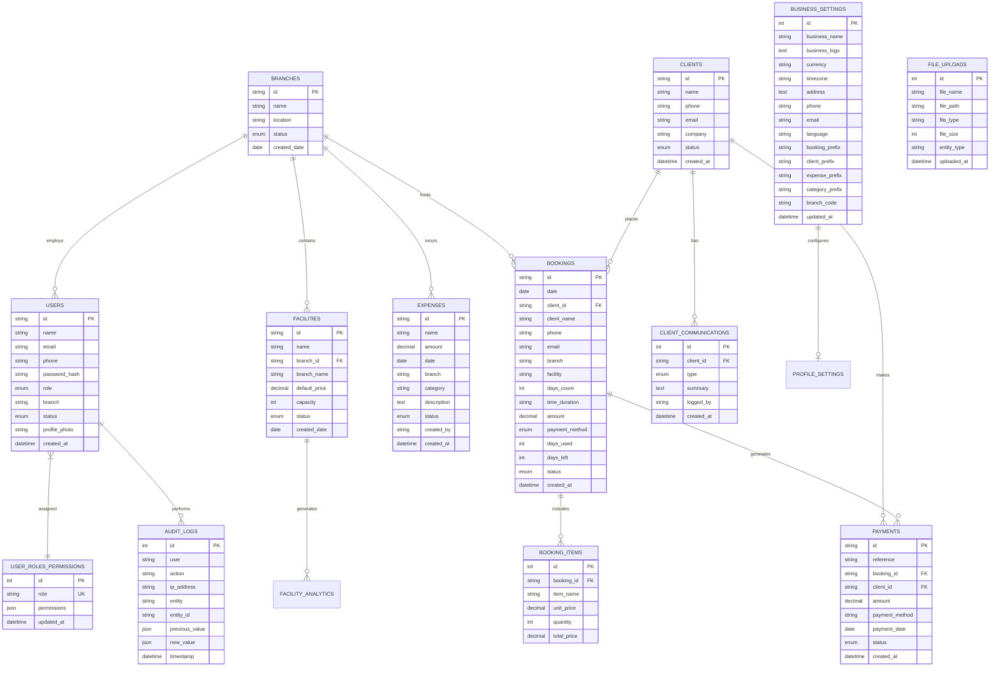

# ERD.md - Entity Relationship Diagram

**Project:** Nexus ERP
**Database Engine:** MySQL 8.0+
**Character Set:** utf8mb4 / utf8mb4_unicode_ci

---

## Visual ERD Diagram (Mermaid)

---

## Entity Relationship Cardinality Table

| Parent Entity | Child Entity | Foreign Key Field | Cardinality | Action on Delete |
|---|---|---|---|---|
| `branches` | `facilities` | `facilities.branch_id` | 1 to Many | `ON DELETE CASCADE` |
| `clients` | `bookings` | `bookings.client_id` | 1 to Many | `ON DELETE CASCADE` |
| `clients` | `client_communications` | `client_communications.client_id` | 1 to Many | `ON DELETE CASCADE` |
| `clients` | `payments` | `payments.client_id` | 1 to Many | `ON DELETE CASCADE` |
| `bookings` | `booking_items` | `booking_items.booking_id` | 1 to Many | `ON DELETE CASCADE` |
| `bookings` | `payments` | `payments.booking_id` | 1 to Many (Optional) | `ON DELETE SET NULL` |

---

*End of ERD.md*
