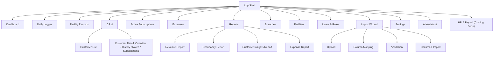
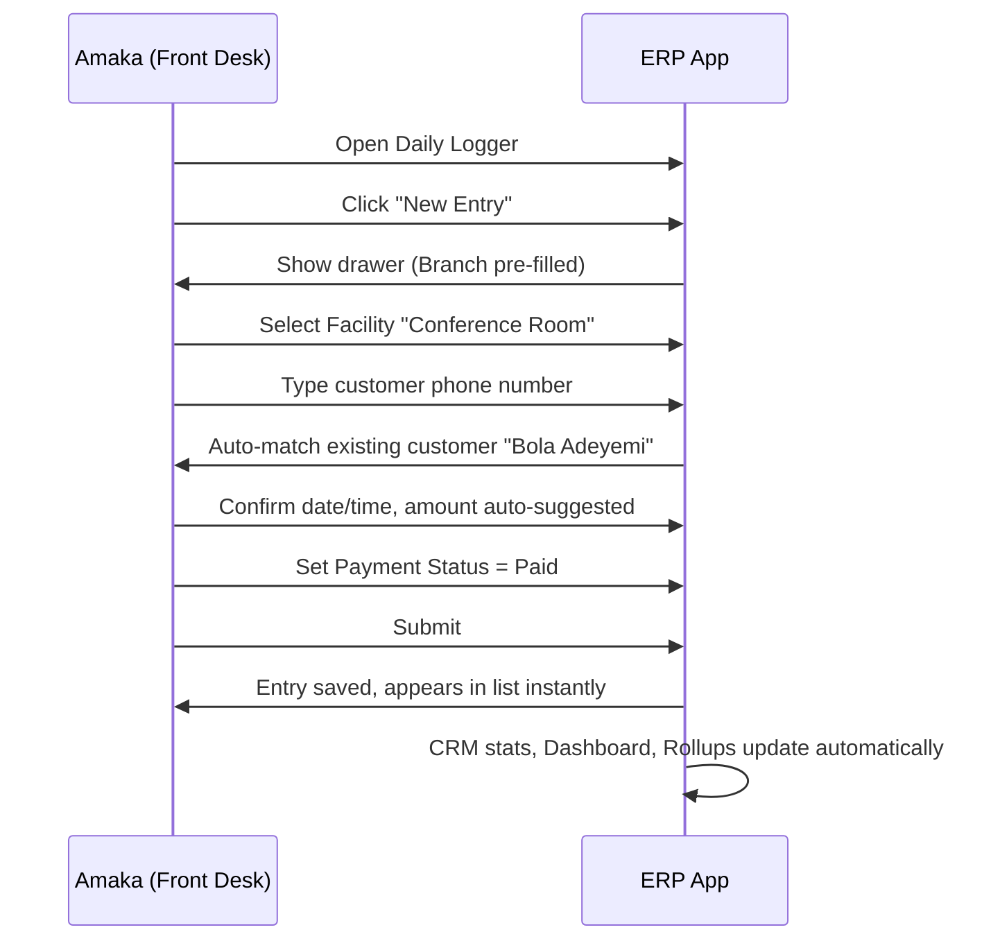

# PRODUCT_SPECIFICATION.md

**Project:** Workspace Management ERP + CRM
**Document Type:** Product Requirements Document (PRD)
**Audience:** Product, Engineering, Design, Business Stakeholders

---

## Table of Contents

1. Vision
2. Objectives & Business Goals
3. User Personas
4. User Roles & Permissions Matrix
5. Complete Navigation Map
6. Module Specifications (Every Page, Screen, Feature)
7. Workflows & User Journeys
8. Business Rules
9. Edge Cases
10. Acceptance Criteria (Representative Set)
11. Future Roadmap
12. Glossary
13. Appendix

---

## 1. Vision

Replace a fragile, error-prone, spreadsheet-based operation with a single, purpose-built system that lets a multi-branch workspace-rental business log every booking in seconds, understand its customers automatically, and see its financial health at a glance — without ever feeling like "enterprise software," and without losing a single row of the operational history built up in Excel over the years.

**The product is successful when:** a front-desk operator can log a walk-in booking faster than they could type it into Excel, and a branch manager can answer "how did we do this month, and who are our best customers?" without opening a spreadsheet at all.

---

## 2. Objectives & Business Goals

| Objective | Business Goal | How the ERP Delivers It |
|---|---|---|
| Eliminate manual spreadsheet errors | Reduce revenue leakage from mistyped/duplicated entries | Structured Daily Logger form with validation, dedupe detection |
| Unify multi-branch operations | Single view across all branches for ownership | Branch-scoped views with an "All Branches" roll-up for Super Admin |
| Turn data into insight | Data-driven decisions on pricing, staffing, facility investment | Dashboard, Reports, CRM analytics — all derived automatically |
| Preserve institutional history | Zero data loss migrating off Excel | Import Wizard + Excel-compatible schema (see DATABASE_ARCHITECTURE.md) |
| Understand customers | Increase repeat bookings and subscription retention | Auto-populated CRM with lifetime value, visit frequency, tags |
| Reduce admin overhead | Free up staff time from manual reporting | Automated dashboards/reports replace manual month-end spreadsheet compilation |

---

## 3. User Personas

### 3.1 Amaka — Front Desk Operator
Works at Hive Hub. Handles walk-ins, phone bookings, and daily payment collection. Not deeply technical; needs speed above all else. Primary screen: Daily Logger. Success = logging a booking in under 20 seconds.

### 3.2 Tunde — Branch Manager
Runs Art & Tech Hub day to day. Cares about occupancy, daily revenue, and which facilities are underperforming. Checks Dashboard every morning and Reports weekly. Occasionally resolves customer disputes using CRM history.

### 3.3 Ngozi — Finance Lead
Cross-branch, reviews Expenses and Reports monthly to prepare business-wide financial summaries for the owners. Needs export-ready reports and trusts the numbers only if they are consistent and auditable.

### 3.4 Chidi — Business Owner (Super Admin)
Oversees both branches remotely. Wants a five-minute daily glance at Dashboard, and a monthly deep-dive into Reports and CRM to plan expansion (e.g., new facility investment, new branch).

### 3.5 Fatima — New Employee (Onboarding)
Just hired as a Front Desk Operator at a new branch. Needs the system to be self-explanatory, since formal training time is limited.

---

## 4. User Roles & Permissions Matrix

| Feature / Module | Super Admin | Branch Manager | Front Desk | Finance | Viewer |
|---|---|---|---|---|---|
| Dashboard (own branch) | ✅ | ✅ | ✅ (limited widgets) | ✅ | ✅ |
| Dashboard (all branches) | ✅ | ❌ | ❌ | ✅ | ✅ (if granted) |
| Daily Logger — create/edit | ✅ | ✅ | ✅ | ❌ | ❌ |
| Daily Logger — delete | ✅ | ✅ | ❌ | ❌ | ❌ |
| Facility Records | ✅ | ✅ | ✅ (read) | ✅ (read) | ✅ (read) |
| CRM — view | ✅ | ✅ | ✅ | ✅ (read) | ✅ (read) |
| CRM — merge customers | ✅ | ✅ | ❌ | ❌ | ❌ |
| Active Subscriptions — manage | ✅ | ✅ | ❌ | ✅ (read) | ❌ |
| Expenses — create/edit | ✅ | ✅ | ❌ | ✅ | ❌ |
| Reports — view/export | ✅ | ✅ (own branch) | ❌ | ✅ (all) | ✅ (read) |
| Branches — manage | ✅ | ❌ | ❌ | ❌ | ❌ |
| Facilities — manage | ✅ | ✅ (own branch) | ❌ | ❌ | ❌ |
| Users & Roles — manage | ✅ | ❌ | ❌ | ❌ | ❌ |
| Import Wizard | ✅ | ✅ (own branch) | ❌ | ❌ | ❌ |
| Settings | ✅ | ✅ (limited) | ❌ | ❌ | ❌ |
| AI Assistant | ✅ | ✅ | ✅ (limited scope) | ✅ | ❌ |

---

## 5. Complete Navigation Map

---

## 6. Module Specifications

### 6.1 Dashboard

**Purpose:** One-glance daily operational and financial health check.

**Widgets:**
- Metric cards: Today's Revenue, Today's Bookings, Active Subscriptions, Occupancy Rate (%).
- Revenue Trend chart (last 30 days, Recharts line chart).
- Top Facilities (bar chart, revenue or booking count toggle).
- Today's Bookings table (live, from Daily Logger).
- Top Customers (this month) card.
- Upcoming Subscription Renewals card (next 7 days).

**Controls:** Branch Switcher (or "All Branches" for Super Admin/Finance), Date Range picker (Today / 7D / 30D / Custom).

**Acceptance:** Every widget reflects real data with no hardcoded placeholders; empty states shown when a branch has no data yet.

### 6.2 Daily Logger

**Purpose:** The single entry point for all bookings — the system's heart.

**Screens:**
- **List view:** date-filterable table of entries (Customer, Facility, Time, Amount, Payment Status, Booking Status, Logged By).
- **New Entry form (drawer):** Branch (pre-filled from user's scope) → Facility (dropdown, branch-scoped) → Customer (typeahead search by name/phone with "Create New" fallback) → Date/Time → Amount (auto-suggested from facility rate, editable) → Payment Status → Notes.
- **Quick Edit:** inline edit of payment status/amount without opening full form for fast-paced front desk use.
- **Bulk actions:** mark multiple entries as paid, export selection.

**Acceptance:** A returning customer's name/phone auto-matches an existing CRM record; a new phone number creates a new customer record transparently; entry creation completes in a single drawer without page navigation.

### 6.3 Facility Records

**Purpose:** Per-facility operational history and performance.

**Screens:**
- Facility list (grouped by branch) with utilization %, revenue (period), booking count.
- Facility detail: booking calendar/timeline view, revenue trend for that facility, rate history.

### 6.4 CRM

**Purpose:** Automatic customer intelligence derived from Daily Logger — never manually populated.

**Screens:**
- Customer list: Name, Phone, Branches Visited, Total Spend, Visit Count, Last Visit, Tags — sortable/filterable.
- Customer detail (tabs): **Overview** (lifetime metrics, favorite facility), **Booking History** (full Daily Logger trail for this customer), **Notes** (staff-editable), **Subscriptions** (active/past).
- Merge tool: search + select duplicate → preview merged result → confirm (logged, reversible via audit trail per DATABASE_ARCHITECTURE.md).

### 6.5 Active Subscriptions

**Purpose:** Manage recurring facility memberships.

**Screens:**
- Subscription list: Customer, Facility, Plan, Monthly Amount, Status, Next Renewal.
- New Subscription form: Customer (search/select) → Facility → Plan Name → Amount → Billing Cycle → Start Date.
- Renewal/expiry alerts surfaced on Dashboard and within this module (badge counts).

### 6.6 Expenses

**Purpose:** Branch-scoped expense tracking feeding financial reports.

**Screens:**
- Expense list: Category, Amount, Date, Description, Branch.
- New Expense form: Branch → Category (rent, utilities, salaries, maintenance, marketing, other) → Amount → Date → Description.
- Category breakdown chart (pie/bar) per period.

### 6.7 Reports

**Purpose:** Exportable, period-based business intelligence.

**Report types:**
- **Revenue Report:** by branch, by facility, by period, with comparison to prior period.
- **Occupancy Report:** utilization rate per facility/branch.
- **Customer Insights Report:** new vs. returning customers, top spenders, churn signals (subscriptions lapsed).
- **Expense Report:** by category, by branch, net income vs. revenue.

**Common features:** date range picker, branch filter, export to CSV/PDF (see PDF/XLSX generation dependencies), scheduled email report (roadmap item, Section 11).

### 6.8 Branches

**Purpose:** Manage the list of physical branch locations.

**Screens:** Branch list (Name, Code, Address, # Facilities, Status) → Branch detail/edit form (Name, Code, Address, Timezone, Active toggle).

### 6.9 Facilities

**Purpose:** Manage facilities within each branch.

**Screens:** Facility list (branch-scoped) → New/Edit Facility form (Name, Code, Type, Hourly Rate, Daily Rate, Capacity, Active toggle). Facility type list is extensible (Section 8, Business Rules).

### 6.10 Users & Roles

**Purpose:** Manage system access.

**Screens:** User list (Name, Email, Role, Branch Access, Status) → New/Edit User form (Name, Email, Role, Branch Access multi-select, temporary password generation).

### 6.11 Import Wizard

**Purpose:** Migrate historical Excel data safely (see DATABASE_ARCHITECTURE.md Section 9 for full technical flow).

**Screens:** Upload → Branch confirmation + Column Mapping → Validation Report (errors highlighted, correctable) → Preview → Confirm Import → Result Summary (rows imported, skipped, errors) → Batch History list (with rollback option for Super Admin).

### 6.12 Settings

**Purpose:** System-wide and personal configuration.

**Sections:** Company Profile, Branch Defaults (currency, timezone), Notification Preferences, Table Density (comfortable/compact), Personal Profile & Password.

### 6.13 AI Assistant

**Purpose:** Conversational access to the same data as Dashboard/Reports, for natural-language questions.

**Capabilities (v1 scope):** answer questions like "What was our revenue at Hive Hub last week?", "Which customers haven't visited in 60 days?", "Summarize this month's expenses by category" — grounded strictly in the same underlying queries as Dashboard/Reports (no hallucinated numbers; if data isn't available, it says so).

### 6.14 HR & Payroll (Coming Soon)

**Purpose (future):** Staff records, shift scheduling, payroll processing. Placeholder screen in v1 communicating roadmap status; no functional scope in this release (see Section 11).

---

## 7. Workflows & User Journeys

### 7.1 Journey: Front Desk Logs a Walk-In Booking

### 7.2 Journey: Branch Manager Reviews Monthly Performance

Tunde opens Dashboard (own branch, last 30 days) → notices Training Room 2 has low occupancy → navigates to Facility Records for detail → cross-references Reports > Occupancy Report for a trend view → decides to run a promotion → later logs into CRM to identify customers who haven't booked recently to target with the promotion.

### 7.3 Journey: Migrating Historical Excel Data

Chidi (Super Admin) uploads 18 months of Excel sheets via Import Wizard, branch by branch → confirms column mapping per sheet → reviews and corrects a handful of ambiguous rows (inconsistent date formats) → confirms import → verifies Dashboard and Reports now reflect historical trends → historical customers appear correctly matched in CRM.

---

## 8. Business Rules

1. A facility belongs to exactly one branch; facility names may repeat across branches but are operationally distinct (see PROJECT_RULES.md Section 23).
2. A customer record is created only via Daily Logger entry or Import Wizard — never a manual "Add Customer" button anywhere in the CRM module.
3. Revenue is attributed to the branch/facility of the booking, regardless of the customer's "home" branch.
4. Cancelled/no-show bookings are retained for demand analytics but excluded from revenue totals.
5. Subscription-generated Daily Logger entries are visually flagged as "Auto (Subscription)" and are not editable in the same way as manual bookings (amount changes must go through the subscription record, not the individual generated entry).
6. Only Super Admin can permanently manage Branches and Users & Roles.
7. Import Wizard operations are always reversible via batch rollback for the lifetime of the batch record.

---

## 9. Edge Cases

| Scenario | Expected Behavior |
|---|---|
| Two customers share the same phone number (family/office line) | System flags a potential duplicate match during entry creation and lets the operator confirm "same customer" or "different customer, add anyway." |
| A facility is deleted/deactivated but has historical bookings | Facility is soft-deleted (marked inactive), historical Daily Logger entries and reports remain fully intact and viewable. |
| A subscription customer also makes a walk-in booking at a different facility | Both records coexist normally; CRM aggregates count both toward lifetime stats. |
| Import file has a row with an unparseable date | Row is flagged in the Validation step for manual correction; batch is not imported until resolved or the row is explicitly excluded. |
| A booking spans midnight (e.g., overnight event space rental) | `end_time` may be earlier than `start_time`; system interprets this as spanning into the next calendar day rather than treating it as an error. |
| Branch Manager tries to view Reports for a branch they don't have access to | 403 Forbidden at the API layer; UI does not even list that branch in their switcher. |
| Customer merge selected the wrong "survivor" record | Merge action is logged with before/after state, allowing manual reversal by a Super Admin via the audit log. |

---

## 10. Acceptance Criteria (Representative Set)

**Daily Logger — New Entry**
- [ ] Given a phone number matching an existing customer, the system auto-fills the customer's name and shows their visit history summary inline.
- [ ] Given a new phone number, the system creates a new customer record silently and confirms this to the operator ("New customer added: Bola Adeyemi").
- [ ] Amount field is pre-populated from the facility's hourly/daily rate but remains editable.
- [ ] Entry cannot be submitted without Branch, Facility, Customer, Date, and Amount.

**CRM**
- [ ] Customer list total spend, visit count, and last visit date always match the sum/count/max of that customer's non-cancelled Daily Logger entries.
- [ ] There is no "Add Customer" button anywhere in the CRM UI.

**Import Wizard**
- [ ] An import batch that fails validation cannot proceed to the Confirm step until all blocking errors are resolved or explicitly excluded.
- [ ] A completed import batch can be rolled back by a Super Admin, and rollback soft-deletes exactly the entries created by that batch.

**Dashboard**
- [ ] Every metric card and chart reflects the currently selected branch and date range with no stale/cached-across-branch data.
- [ ] If a widget's underlying data source is unavailable, it renders a labeled "Not available" empty state rather than a zero or blank.

---

## 11. Future Roadmap

| Phase | Feature | Notes |
|---|---|---|
| v1.1 | Scheduled email reports | Weekly/monthly Reports auto-emailed to Finance/Owners |
| v1.1 | Mobile-optimized Daily Logger | Tablet-first quick entry for front desk on the move |
| v1.2 | HR & Payroll module | Staff records, shift scheduling, payroll runs |
| v1.2 | SSO / Google OAuth login | Enterprise-friendlier authentication |
| v1.3 | Multi-currency support | If business expands beyond current country of operation |
| v1.3 | Customer-facing booking portal | Self-service booking requests feeding into Daily Logger as "pending" entries for staff confirmation |
| v2.0 | Predictive occupancy/demand AI insights | Building on the existing AI Assistant foundation |

---

## 12. Glossary

| Term | Definition |
|---|---|
| **Daily Logger** | The core module where every booking/transaction is recorded; source of truth for the entire system. |
| **Facility** | A rentable space within a branch (e.g., Conference Room, Podcast Room). |
| **Branch** | A physical business location owning one or more facilities. |
| **Subscription** | A recurring booking agreement (e.g., monthly co-working membership) that auto-generates Daily Logger entries. |
| **Rollup** | A pre-aggregated, derived data table used to make dashboards/reports fast. |
| **Import Batch** | A single Excel/CSV upload processed through the Import Wizard, fully auditable and reversible. |
| **Customer Merge** | The reversible, logged operation of combining two duplicate customer records into one. |

---

## 13. Appendix

### 13.1 Example Branch/Facility Structure (from Business Structure input)

| Branch | Facilities |
|---|---|
| Art & Tech Hub | Co-working Space, Conference Room, Private Office, Training Room |
| Hive Hub | Co-working Space, Meeting Room, Conference Room, Training Room, Training Room 2, Podcast Room, Executive Office, Football Field, Public Address System |

### 13.2 Cross-Reference

This PRD should be read alongside:
- `PROJECT_RULES.md` — engineering constitution and standards
- `UI_DESIGN_SYSTEM.md` — visual/interaction specification
- `DATABASE_ARCHITECTURE.md` — schema, relationships, and data flow backing every feature described here

---

*End of PRODUCT_SPECIFICATION.md*