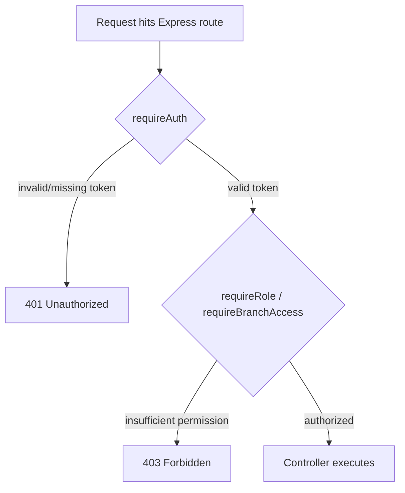
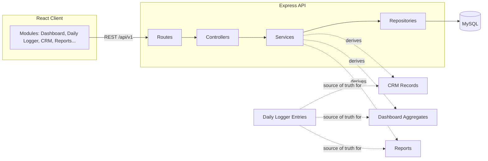

# PROJECT_RULES.md

**Project:** Workspace Management ERP + CRM
**Document Type:** Engineering Constitution
**Status:** Living Document — Version Controlled
**Owners:** Principal Architecture Group
**Audience:** All engineers contributing to this codebase, present and future

> This document is the single source of truth for how this codebase is built, reviewed, and maintained. When code and this document disagree, the code is wrong. If a rule here no longer makes sense, it is changed here first, in a reviewed PR, before the codebase deviates from it.

---

## Table of Contents

1. Project Philosophy
2. Engineering Principles
3. Coding Standards
4. Folder Structure
5. React Standards
6. Express Standards
7. TypeScript Standards
8. Database Rules
9. API Design Rules
10. Naming Conventions
11. Component Rules
12. State Management Rules
13. Performance Rules
14. Security Rules
15. Accessibility Rules
16. Error Handling
17. Logging
18. Authentication
19. Authorization & Role Permissions
20. Import Rules & Excel Compatibility
21. CRM Rules
22. Dashboard Rules
23. Business Rules
24. Responsive Design Rules
25. Animation Rules
26. Testing Standards
27. Git Standards
28. Deployment Standards
29. Forbidden Practices
30. Architecture Principles
31. Code Review Checklist
32. Production Checklist

---

## 1. Project Philosophy

This is **not** a generic ERP. It is a **vertical, opinionated system built for one purpose**: managing the rental of physical workspace and facility time across multiple branches, and turning every booking into usable business intelligence.

Three beliefs shape every decision in this codebase:

1. **The Daily Logger is truth.** Every other module — CRM, Reports, Dashboard, Subscriptions — is a *derived view* of Daily Logger data. No module is permitted to become a second source of truth.
2. **Excel is the migration contract, not the design goal.** The business ran on Excel for years. The database schema must be able to absorb that history losslessly, but the product must not be shaped like a spreadsheet. We import Excel's data, not its constraints.
3. **BI is a first-class citizen, not an afterthought.** Every schema decision, every API endpoint, and every UI screen is designed with "can this answer a business question in one query" in mind.

If a proposed feature does not trace back to a real branch, a real facility, or a real booking, it does not belong in this ERP. Inventory, warehousing, logistics, manufacturing, and procurement concepts are permanently out of scope (see Section 29).

---

## 2. Engineering Principles

| Principle | Meaning in Practice |
|---|---|
| **Single Source of Truth (SSOT)** | Booking data lives once, in Daily Logger tables. CRM, Reports, and Dashboards read via views/queries — they never store a parallel copy of booking facts. |
| **Derive, Don't Duplicate** | Customer records, revenue totals, and subscription states are computed or synced from Daily Logger events, never hand-entered in parallel. |
| **Explicit Over Implicit** | No "magic" business logic hidden in triggers the team forgets exists. Business logic lives in the service layer, in TypeScript, where it is readable and testable. |
| **Fail Loud in Dev, Fail Safe in Prod** | Development throws immediately on invalid state. Production degrades gracefully and logs, never silently drops data. |
| **Backwards-Compatible Migrations** | Every schema migration must not break existing Excel-imported records. |
| **Small, Reviewable Units** | Prefer many small PRs over one large PR. A PR that cannot be reviewed in 30 minutes must be split. |
| **Boring Technology Where Possible** | MySQL, Express, React — no exotic dependencies unless a documented need exists (see Section 29). |

---

## 3. Coding Standards

- **Language:** TypeScript everywhere (frontend and backend). `any` is banned except in explicitly justified, commented exceptions reviewed by a senior engineer.
- **Formatting:** Prettier is the only source of formatting truth. No manual formatting debates in PRs.
- **Linting:** ESLint with `@typescript-eslint/recommended` + `eslint-plugin-react-hooks` + `eslint-plugin-jsx-a11y`. Linting errors block merge; warnings are tracked but do not block.
- **Line length:** Soft limit 100 characters.
- **Comments:** Comments explain *why*, not *what*. Code should be self-explanatory for *what*.
- **Imports:** Absolute imports via path aliases (`@/components`, `@/services`, `@/types`) — no `../../../../` chains beyond one level.
- **File size:** A single file exceeding ~300 lines is a signal to decompose it, not a hard rule.

```ts
// BAD — no context on why
const rate = base * 1.2;

// GOOD — explains business reasoning
// Weekend bookings carry a 20% premium per Branch Pricing Policy v2
const WEEKEND_PREMIUM = 1.2;
const rate = base * WEEKEND_PREMIUM;
```

---

## 4. Folder Structure

```
workspace-erp/
├── apps/
│   ├── client/                     # React frontend
│   │   ├── src/
│   │   │   ├── app/                # App shell, routing, providers
│   │   │   ├── modules/            # Feature-first organization
│   │   │   │   ├── dashboard/
│   │   │   │   ├── daily-logger/
│   │   │   │   ├── facility-records/
│   │   │   │   ├── crm/
│   │   │   │   ├── subscriptions/
│   │   │   │   ├── expenses/
│   │   │   │   ├── reports/
│   │   │   │   ├── branches/
│   │   │   │   ├── facilities/
│   │   │   │   ├── users-roles/
│   │   │   │   ├── import-wizard/
│   │   │   │   ├── settings/
│   │   │   │   └── ai-assistant/
│   │   │   ├── components/         # Shared, cross-module UI primitives
│   │   │   ├── hooks/               # Shared hooks
│   │   │   ├── services/            # API client layer
│   │   │   ├── store/                # Global state (see Section 12)
│   │   │   ├── types/                # Shared TS types/interfaces
│   │   │   ├── utils/
│   │   │   └── styles/
│   │   └── public/
│   └── server/                      # Express backend
│       ├── src/
│       │   ├── modules/             # Mirrors frontend module boundaries
│       │   │   ├── daily-logger/
│       │   │   │   ├── daily-logger.controller.ts
│       │   │   │   ├── daily-logger.service.ts
│       │   │   │   ├── daily-logger.routes.ts
│       │   │   │   ├── daily-logger.repository.ts
│       │   │   │   └── daily-logger.types.ts
│       │   │   ├── crm/
│       │   │   ├── facilities/
│       │   │   ├── branches/
│       │   │   ├── subscriptions/
│       │   │   ├── expenses/
│       │   │   ├── reports/
│       │   │   ├── import-wizard/
│       │   │   ├── users/
│       │   │   └── auth/
│       │   ├── middleware/
│       │   ├── config/
│       │   ├── db/
│       │   │   ├── migrations/
│       │   │   ├── seeds/
│       │   │   └── connection.ts
│       │   ├── jobs/                 # Scheduled/derived-data jobs
│       │   ├── utils/
│       │   └── server.ts
│       └── tests/
├── packages/
│   └── shared-types/                # Types shared between client & server
├── docs/                             # This documentation set
└── scripts/
```

**Rule:** A module's frontend folder name and backend folder name must match exactly (`daily-logger` ↔ `daily-logger`). This is non-negotiable — it is how new engineers navigate the codebase.

---

## 5. React Standards

- **Function components only.** No class components, anywhere, ever.
- **One component per file**, filename matches the component name (`FacilityCard.tsx` exports `FacilityCard`).
- **Co-location:** A component's styles, tests, and sub-components (if not reused elsewhere) live in the same folder.
- **Hooks over HOCs.** No higher-order components in new code.
- **Props typing:** Every component has an explicit `Props` interface, never inline anonymous types for anything beyond 1-2 primitives.
- **No prop drilling beyond 2 levels** — use context or the store (Section 12) instead.
- **Suspense + lazy loading** for route-level module code splitting (each module in Section 4 is its own chunk).

```tsx
// modules/daily-logger/components/BookingRow.tsx
interface BookingRowProps {
  booking: DailyLoggerEntry;
  onEdit: (id: string) => void;
}

export function BookingRow({ booking, onEdit }: BookingRowProps) {
  return (
    <tr>
      <td>{booking.customerName}</td>
      <td>{booking.facilityName}</td>
      <td>{formatCurrency(booking.amount)}</td>
    </tr>
  );
}
```

---

## 6. Express Standards

- **Layered architecture, strictly enforced:** `Route → Controller → Service → Repository → Database`. Controllers never touch SQL. Services never touch `req`/`res`.
- **Routes are declarative only** — they map HTTP verbs to controller methods and attach middleware, nothing else.
- **One router per module**, mounted under a versioned prefix: `/api/v1/daily-logger`, `/api/v1/crm`, etc.
- **Async errors:** every controller wraps async handlers with a shared `asyncHandler` utility so errors flow to the centralized error middleware (Section 16).
- **Validation at the edge:** request payloads are validated (Zod) in the controller/middleware layer before ever reaching a service.

```ts
// daily-logger.routes.ts
router.post(
  "/",
  requireAuth,
  requireRole(["ADMIN", "FRONT_DESK"]),
  validateBody(createLoggerEntrySchema),
  asyncHandler(dailyLoggerController.create)
);
```

---

## 7. TypeScript Standards

- `strict: true` in `tsconfig.json` for both apps, no exceptions.
- Shared domain types (Branch, Facility, Booking, Customer, Subscription) live in `packages/shared-types` and are imported by both client and server — **never redefined in both places**.
- Prefer `interface` for object shapes, `type` for unions/utility compositions.
- Enums are used sparingly; prefer string literal unions for simple cases (`type BookingStatus = "confirmed" | "cancelled" | "no-show"`), reserve real `enum` for values persisted as DB lookup codes.
- No `as any` casts to silence the compiler. If a cast is unavoidable, use a narrow, documented type guard.

---

## 8. Database Rules

- **MySQL only.** No mixing in a document store for core business data.
- **Every table has:** `id` (BIGINT UNSIGNED, auto-increment, PK), `created_at`, `updated_at`, and `deleted_at` (soft delete, nullable) unless explicitly justified otherwise (see DATABASE_ARCHITECTURE.md).
- **Foreign keys are enforced at the DB level**, not just in application code.
- **No business logic in stored procedures or triggers** beyond simple `updated_at` maintenance — logic lives in the service layer where it is testable and version-controlled.
- **All monetary values** stored as `DECIMAL(12,2)`, never `FLOAT`/`DOUBLE`.
- **All timestamps** stored in UTC; conversion to branch-local time happens in the presentation layer.
- Migrations are the only way schema changes reach the database — direct phpMyAdmin schema edits in any environment beyond a developer's own local sandbox are forbidden.

---

## 9. API Design Rules

- REST, versioned under `/api/v1/`.
- Resource-oriented URLs: `/facilities/:id/bookings`, not `/getFacilityBookings`.
- Standard response envelope:

```json
{
  "success": true,
  "data": { },
  "meta": { "page": 1, "pageSize": 20, "total": 134 }
}
```

Error envelope:

```json
{
  "success": false,
  "error": { "code": "FACILITY_NOT_FOUND", "message": "Facility does not exist." }
}
```

- **Pagination is mandatory** on all list endpoints (`page`, `pageSize`, max `pageSize` = 100).
- **Filtering** via query params using a documented, consistent scheme (`?branchId=&facilityId=&dateFrom=&dateTo=`).
- **Idempotency:** All `POST` endpoints that create Daily Logger entries accept an optional `Idempotency-Key` header to prevent duplicate bookings on retry (critical given flaky front-desk connectivity).

---

## 10. Naming Conventions

| Item | Convention | Example |
|---|---|---|
| Database tables | `snake_case`, plural | `daily_logger_entries`, `facilities` |
| Database columns | `snake_case` | `branch_id`, `check_in_time` |
| TypeScript types/interfaces | `PascalCase` | `DailyLoggerEntry`, `FacilityRecord` |
| TypeScript variables/functions | `camelCase` | `getBookingsByBranch()` |
| React components | `PascalCase` | `FacilityCard.tsx` |
| React hooks | `camelCase`, prefixed `use` | `useDailyLogger()` |
| API routes | `kebab-case`, plural nouns | `/api/v1/daily-logger`, `/api/v1/facility-records` |
| Env variables | `SCREAMING_SNAKE_CASE` | `DATABASE_URL`, `JWT_SECRET` |
| CSS/Design tokens | `kebab-case` | `--color-accent-blue` |
| Branch codes | `UPPER_SNAKE`, short | `ATH` (Art & Tech Hub), `HIVE` (Hive Hub) |
| Facility codes | `Branch prefix + facility slug` | `HIVE-CONF-01`, `ATH-COWORK-01` |

**Rule:** Facility codes must be globally unique across branches, even though facility *names* may repeat (e.g., every branch may have a "Conference Room").

---

## 11. Component Rules

- **Atomic, but pragmatic:** primitives (Button, Input, Badge) → composed components (BookingRow, MetricCard) → module screens (DailyLoggerPage). Do not over-engineer atomic design theory beyond this three-tier mental model.
- Every interactive component must support keyboard focus and a visible focus ring (Section 15).
- No component fetches data directly with `fetch`/`axios` inline — data fetching goes through the `services/` API layer and a data hook (`useFacilities()`, `useDailyLoggerEntries()`).
- Loading, empty, and error states are **required props/paths** for any component rendering async data — a component that only handles the "happy path" fails review.

---

## 12. State Management Rules

| State Type | Tool | Example |
|---|---|---|
| Server/remote data | React Query (TanStack Query) | List of bookings, facilities, customers |
| Global UI/app state | Zustand | Active branch selector, sidebar collapsed state, current user |
| Local component state | `useState`/`useReducer` | Form input, modal open/close |
| URL-driven state | React Router search params | Filters, active tab, pagination page |

**Rule:** Server data is never duplicated into Zustand. Zustand holds *client* state only. If you find yourself copying API data into a global store "for convenience," that is a code smell — use React Query's cache instead.

---

## 13. Performance Rules

- Route-based code splitting is mandatory for every module.
- Lists over 50 rows use virtualization (`@tanstack/react-virtual`).
- All list/report endpoints must be indexed for their primary filter columns (`branch_id`, `facility_id`, `booking_date`) — see DATABASE_ARCHITECTURE.md.
- Dashboard aggregate queries are pre-computed via scheduled jobs where real-time computation would be expensive (e.g., monthly revenue rollups), never computed by scanning raw Daily Logger rows on every page load.
- Images/illustrations are served as optimized WebP/SVG.
- Bundle size budget: initial JS payload target < 250KB gzipped for the shell; module chunks loaded on demand.

---

## 14. Security Rules

- All input validated server-side (Zod) regardless of client-side validation.
- Parameterized queries only — **no raw string concatenation into SQL, ever**, even for internal admin tools.
- Passwords hashed with `bcrypt` (cost factor ≥ 12). Never store plaintext, never log passwords.
- JWTs are short-lived (15 min access token) with rotating refresh tokens stored as httpOnly, secure cookies.
- Rate limiting on all authentication endpoints.
- CORS locked to known origins per environment — no wildcard `*` in production.
- Secrets (`DATABASE_URL`, `JWT_SECRET`, hosting credentials) live only in environment variables / Hostinger's secret manager — never committed to git.
- File uploads (Excel imports) are scanned for type/size before processing; only `.xlsx`/`.xls`/`.csv` accepted, max size enforced.

---

## 15. Accessibility Rules

- WCAG 2.1 AA is the baseline target for all screens.
- Every interactive element reachable and operable via keyboard.
- Color is never the sole indicator of status — status pills always pair color with text/icon.
- Minimum contrast ratio 4.5:1 for body text, 3:1 for large text, verified against the design tokens in UI_DESIGN_SYSTEM.md.
- All form inputs have associated `<label>` elements (visually hidden if design requires, never omitted).
- Modals trap focus and restore it to the triggering element on close.

---

## 16. Error Handling

- **Centralized error middleware** on the Express app — every thrown/rejected error funnels through it and is normalized to the standard error envelope (Section 9).
- Custom error classes: `NotFoundError`, `ValidationError`, `UnauthorizedError`, `ForbiddenError`, `ConflictError` — each maps to a fixed HTTP status.
- Frontend: React Error Boundaries wrap each top-level module route so one module crashing does not take down the whole app shell.
- Never swallow errors silently (`catch {}` with no action is forbidden). At minimum, log and re-throw or return a typed error result.

---

## 17. Logging

- Structured JSON logging (`pino` recommended) — never `console.log` in committed backend code.
- Log levels: `error`, `warn`, `info`, `debug`. Production runs at `info`.
- Every log line includes: timestamp, level, module, requestId, and (if authenticated) userId — never the full request body if it contains PII or payment data.
- Daily Logger create/update/delete actions are always logged at `info` with the actor's user ID — this is the audit trail backbone described in DATABASE_ARCHITECTURE.md.

---

## 18. Authentication

- Email + password login, bcrypt-hashed, JWT-based session.
- Access token: 15-minute expiry, sent as `Authorization: Bearer`.
- Refresh token: 7-day expiry, httpOnly secure cookie, rotated on each use.
- Optional future: SSO/Google OAuth for enterprise clients (tracked in PRODUCT_SPECIFICATION.md roadmap) — not in v1 scope.
- Failed login attempts are rate-limited (5 attempts / 15 minutes per account+IP combination).

---

## 19. Authorization & Role Permissions

| Role | Description | Typical Scope |
|---|---|---|
| **Super Admin** | Full system access, all branches | Business owner(s) |
| **Branch Manager** | Full access within their assigned branch(es) | Facility, CRM, Reports for their branch |
| **Front Desk / Operator** | Creates/edits Daily Logger entries, views CRM (read-mostly) | Assigned branch only |
| **Finance** | Read access to Reports, Expenses, Revenue; no Daily Logger write | Cross-branch, read-only financial |
| **Viewer** | Read-only dashboard and reports | Stakeholders, investors |

**Rule:** Authorization is enforced **server-side** on every route via `requireRole()`/`requireBranchAccess()` middleware. Hiding a button on the frontend is a UX nicety, never a security boundary.



---

## 20. Import Rules & Excel Compatibility

- The Import Wizard is the **only** sanctioned path for historical data entry. Manual bulk SQL inserts into production are forbidden.
- Every import run creates an `import_batches` record (see DATABASE_ARCHITECTURE.md) so any batch can be audited or rolled back.
- Column mapping is explicit and user-confirmed at import time — the system never guesses silently which Excel column means what without the operator confirming the mapping.
- Imported rows preserve original Excel row references (`source_row_number`, `source_sheet_name`) for traceability during the transition period.
- Duplicate detection during import runs against `customer_name + phone` and `facility + date + time` composite matching, with conflicts surfaced to the operator rather than auto-resolved.
- Currency/date formats from Excel (which are often inconsistent) are normalized during import validation, with a manual review step for ambiguous rows.

---

## 21. CRM Rules

- **CRM records are never created directly by a user.** A customer only exists in CRM because a Daily Logger entry referenced them.
- When a Daily Logger entry is created with a new customer name/phone combination, the system auto-creates (or matches to) a `customers` record.
- CRM is a **read+enrich** surface: users may add notes, tags, and follow-up reminders to a customer, but the customer's booking history, spend, and visit frequency are always computed from Daily Logger data, never manually edited.
- Customer merge (when duplicate customers are discovered) is an explicit, logged, reversible operation — never a silent delete.

---

## 22. Dashboard Rules

- Every dashboard widget must be traceable to a specific, named query/view — no "mystery numbers."
- Dashboards are branch-scoped by default, with an explicit "All Branches" toggle for Super Admin/Finance roles.
- Real-time widgets (today's bookings, today's revenue) query live; historical/trend widgets (monthly revenue, YoY growth) use pre-aggregated rollup tables refreshed on a schedule (see Section 13).
- No dashboard metric is hardcoded or mocked in production code paths — if a data source isn't ready, the widget shows an explicit "Not available yet" empty state, never a fake number.

---

## 23. Business Rules

- A **branch** owns a distinct set of **facilities**; facilities are never assumed shared across branches, even if named identically.
- A **booking** always references exactly one branch and one facility.
- Revenue is attributed to the branch/facility of the booking, not to the customer's "home" branch (a customer may book across multiple branches).
- **Subscriptions** represent recurring facility access (e.g., monthly co-working membership) and are derived from recurring Daily Logger patterns or explicitly created subscription records that generate expected recurring Daily Logger entries.
- **Expenses** are branch-scoped and categorized (rent, utilities, salaries, maintenance, marketing, other) for reporting purposes.

---

## 24. Responsive Design Rules

- Breakpoints: Mobile (<640px), Tablet (640–1024px), Desktop (>1024px) — full detail in UI_DESIGN_SYSTEM.md.
- Daily Logger and CRM tables collapse to card-based layouts below 1024px — tables are never simply shrunk/scrolled horizontally as the sole mobile strategy.
- Sidebar collapses to an icon rail on tablet, and to a bottom/overlay nav pattern on mobile.
- Every screen is designed desktop-first (this is primarily a front-desk/back-office tool used on desktop) but must remain fully usable on tablet for on-the-go branch managers.

---

## 25. Animation Rules

- Animations are functional, never decorative. Purpose: communicate state change (loading, success, transition), not to impress.
- Standard easing: `cubic-bezier(0.4, 0, 0.2, 1)`, standard duration 150–250ms for UI transitions.
- No parallax, no "AI sparkle" shimmer effects, no bouncing/elastic easing on business UI elements.
- Skeleton loaders use a subtle, slow shimmer (see UI_DESIGN_SYSTEM.md) — never a spinner-only experience for content areas that support skeletons.

---

## 26. Testing Standards

| Layer | Tool | Minimum Bar |
|---|---|---|
| Unit (services, utils) | Vitest/Jest | ≥80% coverage on `services/` and business logic |
| Component | React Testing Library | Every shared component has a render + interaction test |
| API/Integration | Supertest against a test MySQL instance | Every route has a happy-path + auth-failure + validation-failure test |
| E2E | Playwright | Critical flows: login, create Daily Logger entry, run Import Wizard, generate a report |

- Tests run in CI on every PR; failing tests block merge.
- No test is skipped/`.skip()`'d without a linked ticket explaining why.

---

## 27. Git Standards

- Trunk-based development off `main`, with short-lived feature branches: `feature/daily-logger-bulk-edit`, `fix/crm-duplicate-merge`.
- Commit messages follow Conventional Commits: `feat:`, `fix:`, `refactor:`, `docs:`, `chore:`, `test:`.
- No direct pushes to `main` — all changes via PR with at least one approval.
- Squash-merge is the default merge strategy to keep history readable.

---

## 28. Deployment Standards

- Environments: `development` → `staging` → `production`, each with its own MySQL database on Hostinger.
- Migrations run automatically as part of the deployment pipeline, never manually via phpMyAdmin in staging/production.
- Environment variables managed per-environment; production secrets never appear in any repo file, including `.env.example` (which contains keys only, no values).
- Rollback plan required for every production deploy touching the database (forward-compatible migrations preferred over destructive ones — see DATABASE_ARCHITECTURE.md migration strategy).

---

## 29. Forbidden Practices

The following are **permanently forbidden** in this codebase, regardless of who requests them or how the request is framed:

- ❌ Adding Inventory, Warehouse, Stock, Fleet, Logistics, Manufacturing, Purchase Orders, Suppliers, Sales Orders, Product Catalogue, or Procurement modules.
- ❌ Manually creating CRM customers outside of a Daily Logger-originated flow.
- ❌ Raw SQL string concatenation.
- ❌ `console.log` in committed backend code.
- ❌ Class-based React components.
- ❌ Storing money as `FLOAT`/`DOUBLE`.
- ❌ Direct schema edits in staging/production via phpMyAdmin outside of a migration.
- ❌ Client-side-only authorization checks with no server-side enforcement.
- ❌ Neon colors, glassmorphism, AI-sparkle iconography, robot/CPU/database icons in the UI (see UI_DESIGN_SYSTEM.md).
- ❌ Hardcoded/mocked dashboard numbers shipped to production.

---

## 30. Architecture Principles



- **Layered, modular monolith** for v1 — not microservices. The business does not yet have the scale or team size to justify microservice overhead; the modular folder structure (Section 4) keeps a future extraction possible without paying the tax today.
- **Derived-data jobs** (nightly rollups for dashboards/reports) run as scheduled Node jobs within the same deployment, with a clear path to extraction into a separate worker process if load grows (see DATABASE_ARCHITECTURE.md, Future Scalability).

---

## 31. Code Review Checklist

Every PR must be checked against:

- [ ] Follows folder structure and naming conventions (Sections 4, 10)
- [ ] No forbidden modules/practices introduced (Section 29)
- [ ] Server-side authorization present on any new route (Section 19)
- [ ] Input validated with Zod schema (Section 9, 14)
- [ ] Loading/empty/error states handled for any new async UI (Section 11)
- [ ] No raw SQL concatenation; parameterized queries only (Section 14)
- [ ] Tests added/updated per Section 26 minimum bar
- [ ] No new `any` types without justification comment
- [ ] Accessible: keyboard nav + labels verified (Section 15)
- [ ] Excel/Import compatibility unaffected, or explicitly updated with a migration note (Section 20)

---

## 32. Production Checklist

Before any production release:

- [ ] All migrations tested against a staging copy of production-like data
- [ ] Rollback plan documented for schema changes
- [ ] Dashboard/report queries checked against `EXPLAIN` for index usage
- [ ] Secrets rotated/verified in Hostinger environment config
- [ ] Rate limiting active on auth and import endpoints
- [ ] Error monitoring/alerting configured for the error middleware (Section 16)
- [ ] Backup taken immediately before migration run (see DATABASE_ARCHITECTURE.md Backup Strategy)
- [ ] Smoke test: login, create a Daily Logger entry, view Dashboard, run a report export

---

*End of PROJECT_RULES.md*