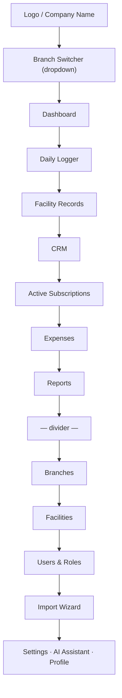

# UI_DESIGN_SYSTEM.md

**Project:** Workspace Management ERP + CRM
**Document Type:** Design System Specification
**Status:** Living Document — Version Controlled
**Audience:** Product Designers, Frontend Engineers

> This is a premium business SaaS interface, not a futuristic AI product. Every decision below optimizes for clarity, trust, and speed of daily operational use by front-desk staff, branch managers, and finance teams — inspired by Stripe Dashboard, Linear, Notion, Vercel Dashboard, and Framer.

---

## Table of Contents

1. Brand Identity
2. Color System
3. Typography
4. Spacing Scale
5. Grid System
6. Design Tokens
7. Sidebar & Navigation
8. Buttons
9. Cards
10. Tables
11. Forms
12. Modals & Drawers
13. Dropdowns & Filters
14. Badges & Status Pills
15. Metric Cards
16. Charts
17. Empty States
18. Loading Skeletons
19. Toast Notifications
20. AI Assistant Panel
21. Dashboard Layout
22. CRM Layout
23. Responsive Behaviour
24. Accessibility
25. Animation Guidelines
26. Icon Usage
27. Illustration Rules
28. Component Library
29. Design Do's and Don'ts

---

## 1. Brand Identity

The product should feel like **quiet, competent software** — the kind a bank or a serious B2B SaaS company would ship. It is used daily by non-technical front-desk staff, so clarity always wins over cleverness.

**Never:**
❌ Futuristic UI, neon colors, glassmorphism, AI sparkles, robot/CPU/database icons, excessive gradients.

**Always:**
✅ White backgrounds, light gray surfaces, a single confident blue accent, generous professional spacing, rounded cards, soft shadows, minimalist navigation, enterprise typography.

---

## 2. Color System

### 2.1 Core Palette

| Token | Hex | Usage |
|---|---|---|
| `--color-bg` | `#FFFFFF` | Page background |
| `--color-surface` | `#F7F8FA` | Section/panel backgrounds |
| `--color-surface-alt` | `#F0F2F5` | Nested surfaces, table header row |
| `--color-border` | `#E4E7EC` | Default borders/dividers |
| `--color-border-strong` | `#D0D5DD` | Input borders, emphasized dividers |
| `--color-text-primary` | `#101828` | Headings, primary text |
| `--color-text-secondary` | `#475467` | Body copy, labels |
| `--color-text-tertiary` | `#98A2B3` | Placeholder, disabled text |
| `--color-accent` | `#2563EB` | Primary brand blue — CTAs, active states, links |
| `--color-accent-hover` | `#1D4ED8` | Hover state of accent |
| `--color-accent-subtle` | `#EFF4FF` | Accent-tinted backgrounds (active nav, selected rows) |

### 2.2 Semantic Colors

| Token | Hex | Usage |
|---|---|---|
| `--color-success` | `#12B76A` | Confirmed bookings, positive revenue trend |
| `--color-success-subtle` | `#ECFDF3` | Success badge background |
| `--color-warning` | `#F79009` | Pending, due-soon subscriptions |
| `--color-warning-subtle` | `#FFFAEB` | Warning badge background |
| `--color-error` | `#F04438` | Cancelled, overdue, failed |
| `--color-error-subtle` | `#FEF3F2` | Error badge background |
| `--color-info` | `#0BA5EC` | Informational callouts |

### 2.3 Branch Accent Colors (Optional, for multi-branch visual differentiation)

Each branch may carry a subtle identifying accent used only in small UI elements (branch pill, calendar swimlanes) — never replacing the core blue accent for primary actions.

| Branch | Accent |
|---|---|
| Art & Tech Hub | `#7C3AED` (violet, subtle) |
| Hive Hub | `#0E9384` (teal, subtle) |

**Rule:** Branch colors are decorative labels only. Primary actions (buttons, links, focus rings) are always `--color-accent`.

---

## 3. Typography

| Font | Role |
|---|---|
| **Outfit** | Headings (H1–H4), metric numbers, nav labels — geometric, confident |
| **Inter** | Body text, table content, form inputs, everything else |

### Type Scale

| Token | Size / Line Height | Weight | Font | Usage |
|---|---|---|---|---|
| `--text-display` | 32px / 40px | 600 | Outfit | Page titles |
| `--text-h2` | 24px / 32px | 600 | Outfit | Section headers |
| `--text-h3` | 18px / 26px | 600 | Outfit | Card headers, modal titles |
| `--text-metric` | 28px / 34px | 700 | Outfit | Dashboard metric numbers |
| `--text-body-lg` | 16px / 24px | 400 | Inter | Emphasized body |
| `--text-body` | 14px / 20px | 400 | Inter | Default body, table cells |
| `--text-body-sm` | 13px / 18px | 400 | Inter | Secondary/meta text |
| `--text-label` | 12px / 16px | 500 | Inter | Form labels, table headers (uppercase, letter-spacing 0.02em) |

---

## 4. Spacing Scale

4px base unit, consistent across margin/padding/gap:

| Token | Value |
|---|---|
| `--space-1` | 4px |
| `--space-2` | 8px |
| `--space-3` | 12px |
| `--space-4` | 16px |
| `--space-5` | 20px |
| `--space-6` | 24px |
| `--space-8` | 32px |
| `--space-10` | 40px |
| `--space-12` | 48px |
| `--space-16` | 64px |

**Rule:** Card interior padding is `--space-6` (24px) by default. Compact table rows use `--space-3`/`--space-4`.

---

## 5. Grid System

- 12-column responsive grid, 24px gutter on desktop, 16px on tablet, 12px on mobile.
- Max content width: 1440px, centered, with `--space-8` side padding on desktop.
- Dashboard metric cards use a 4-column grid on desktop (≥1280px), 2-column on tablet, 1-column stacked on mobile.

---

## 6. Design Tokens

```css
:root {
  /* Color */
  --color-bg: #FFFFFF;
  --color-surface: #F7F8FA;
  --color-surface-alt: #F0F2F5;
  --color-border: #E4E7EC;
  --color-border-strong: #D0D5DD;
  --color-text-primary: #101828;
  --color-text-secondary: #475467;
  --color-text-tertiary: #98A2B3;
  --color-accent: #2563EB;
  --color-accent-hover: #1D4ED8;
  --color-accent-subtle: #EFF4FF;
  --color-success: #12B76A;
  --color-warning: #F79009;
  --color-error: #F04438;
  --color-info: #0BA5EC;

  /* Radius */
  --radius-sm: 6px;
  --radius-md: 10px;
  --radius-lg: 14px;
  --radius-full: 999px;

  /* Shadow */
  --shadow-sm: 0 1px 2px rgba(16, 24, 40, 0.05);
  --shadow-md: 0 4px 12px rgba(16, 24, 40, 0.08);
  --shadow-lg: 0 12px 24px rgba(16, 24, 40, 0.10);

  /* Motion */
  --ease-standard: cubic-bezier(0.4, 0, 0.2, 1);
  --duration-fast: 150ms;
  --duration-base: 200ms;
}
```

---

## 7. Sidebar & Navigation

- Fixed left sidebar, 240px expanded / 72px collapsed (icon rail).
- Structure top-to-bottom: Brand mark → Branch Switcher → Primary nav (Dashboard, Daily Logger, Facility Records, CRM, Active Subscriptions, Expenses, Reports) → Secondary nav (Branches, Facilities, Users & Roles, Import Wizard) → footer (Settings, AI Assistant, user profile menu).
- Active nav item: `--color-accent-subtle` background, `--color-accent` text and left border indicator (3px), icon filled.
- HR & Payroll appears with a "Coming Soon" tag (muted, non-clickable or leads to a preview screen).



---

## 8. Buttons

| Variant | Background | Text | Usage |
|---|---|---|---|
| Primary | `--color-accent` | White | Main CTA per screen (Save, Create Booking) |
| Secondary | White, `--color-border-strong` border | `--color-text-primary` | Secondary actions (Cancel, Export) |
| Ghost | Transparent | `--color-text-secondary` | Tertiary/inline actions |
| Destructive | `--color-error` | White | Delete, Cancel Booking |
| Disabled | `--color-surface-alt` | `--color-text-tertiary` | Non-interactive |

- Sizes: `sm` (32px height), `md` (40px height, default), `lg` (48px height).
- Border radius: `--radius-md` (10px).
- Icon-only buttons are always `40x40px` minimum tap target.

---

## 9. Cards

- Background white, `1px solid var(--color-border)`, `--radius-lg`, `--shadow-sm` at rest, `--shadow-md` on hover if interactive.
- Standard padding `--space-6`.
- Card header: title (`--text-h3`) + optional right-aligned action (button/dropdown).
- Cards never nest more than one level deep visually (a card inside a card is avoided — use a section divider instead).

---

## 10. Tables

- Header row: `--color-surface-alt` background, `--text-label` styling, sticky on scroll.
- Row height: 48px default (compact mode: 40px, available as a density toggle in Settings).
- Zebra striping avoided — instead use a subtle bottom border (`--color-border`) between rows and a hover background (`--color-surface`).
- Row-level actions appear in a right-aligned overflow menu (⋯), revealed on hover on desktop, always visible on touch devices.
- Sortable columns show a subtle arrow icon on the header; active sort column header text uses `--color-accent`.
- Tables always paginate (see PROJECT_RULES.md API rules) with page controls bottom-right.

---

## 11. Forms

- Label above input, `--text-label` style, `--space-2` gap.
- Input height 40px, `--radius-md`, `1px solid var(--color-border-strong)`, focus state: `2px` accent ring + border color `--color-accent`.
- Helper text below input in `--text-body-sm`, `--color-text-tertiary`; error text same position, `--color-error`.
- Required fields marked with a subtle asterisk, never solely by color.
- Multi-step forms (e.g., Daily Logger new booking, Import Wizard) use a horizontal stepper at the top showing step name + progress, not just "Step 2 of 4."

---

## 12. Modals & Drawers

- **Modals** for focused, single-decision actions (confirm cancellation, quick edit). Max width 480–640px, centered, backdrop `rgba(16,24,40,0.45)`.
- **Drawers** (right-side slide-in, 480px wide on desktop, full-screen on mobile) for richer forms that benefit from more space while keeping page context (e.g., "New Daily Logger Entry," "Customer Detail").
- Both trap focus, close on `Esc` and backdrop click (with confirmation if unsaved changes exist), and restore focus to the triggering element on close.

---

## 13. Dropdowns & Filters

- Dropdown menus: white background, `--shadow-md`, `--radius-md`, `--space-2` internal padding, items 36px height, hover `--color-surface`.
- Filter bar sits directly below page header on list screens (Daily Logger, CRM, Reports): branch filter, date range, facility filter, status filter, search — all in a single horizontal row that wraps on tablet/mobile.
- Active filters render as removable chips below the filter bar so users always see what's currently applied.

---

## 14. Badges & Status Pills

| Status | Style |
|---|---|
| Confirmed | `--color-success-subtle` bg, `--color-success` text/dot |
| Pending | `--color-warning-subtle` bg, `--color-warning` text/dot |
| Cancelled / Overdue | `--color-error-subtle` bg, `--color-error` text/dot |
| Completed | `--color-surface-alt` bg, `--color-text-secondary` text |
| Info / New | `--color-accent-subtle` bg, `--color-accent` text |

- Pill shape: `--radius-full`, `--space-1` vertical / `--space-3` horizontal padding, `--text-body-sm` weight 500, always paired with a small dot or icon (never color alone — Accessibility Section 24).

---

## 15. Metric Cards

Used heavily on the Dashboard. Structure:

```
[ Label (text-label, secondary) ]
[ Big number (text-metric, Outfit)  ]  [ optional small icon ]
[ Δ vs previous period (small pill: ▲ 12.4% success-colored / ▼ error-colored) ]
```

- No background gradient behind the number. Optional: a tiny sparkline (Recharts) beneath the delta for trend context.
- Grid of 4 across on desktop dashboard (e.g., Today's Revenue, Today's Bookings, Active Subscriptions, Occupancy Rate).

---

## 16. Charts

- **Library:** Recharts exclusively — no mixing chart libraries.
- Color usage: line/bar charts use `--color-accent` as the primary series; secondary series use muted grays or the semantic success/warning/error palette only when representing those states (not for arbitrary category #3, #4...).
- Gridlines: light, `--color-border`, horizontal only (no vertical gridlines) for cleaner reading.
- Tooltips: white card, `--shadow-md`, `--radius-md`, matches Card styling exactly for visual consistency.
- No 3D charts, no excessive drop shadows on chart elements, no more than 5–6 series in one chart (split into multiple charts instead).

---

## 17. Empty States

Every list/table/report has a designed empty state, never a blank white area:

```
[ Simple line-art icon, muted gray, 48–64px ]
[ Short headline: "No bookings yet today" ]
[ One supporting sentence ]
[ Primary CTA if actionable: "Add Booking" ]
```

No AI-sparkle or robot illustrations — use simple, geometric line icons consistent with Font Awesome's outline set.

---

## 18. Loading Skeletons

- Skeleton blocks use `--color-surface-alt` with a slow (1.5s), subtle left-to-right shimmer gradient — never a spinner as the default for content areas that have a known shape (tables, cards, charts).
- Spinners are reserved for indeterminate actions (button submit state, full-page auth check).

---

## 19. Toast Notifications

- Position: bottom-right on desktop, bottom-center on mobile.
- Variants mirror semantic colors (success/warning/error/info), white background with a colored left border (4px) and icon — not a fully colored background (keeps the "quiet SaaS" feel).
- Auto-dismiss after 4s for success/info; errors persist until dismissed or 8s.

---

## 20. AI Assistant Panel

- Presented as a **right-side drawer**, not a floating bubble or futuristic overlay.
- Header: "AI Assistant" in plain text with a simple chat/message-bubble Font Awesome icon (no robot icon, no sparkle icon).
- Message bubbles: user messages right-aligned `--color-accent-subtle` background; assistant messages left-aligned `--color-surface` background — both `--radius-lg`, no neon or gradient styling.
- Suggested prompt chips (e.g., "Summarize today's revenue," "Which facility is underbooked this week?") appear above the input when the panel is empty.
- The assistant may render inline mini-charts or tables in its responses, styled identically to the rest of the design system (reuses Card, Table, Chart tokens) — it must never look like a visually distinct "AI zone."

---

## 21. Dashboard Layout

```
┌───────────────────────────────────────────────────────────┐
│ Page Header: "Dashboard"      [Branch Switcher] [Date Range]│
├───────────────────────────────────────────────────────────┤
│ [Metric] [Metric] [Metric] [Metric]                         │
├───────────────────────────────────────────────────────────┤
│ [ Revenue Trend Chart (2/3 width) ] [ Top Facilities (1/3) ]│
├───────────────────────────────────────────────────────────┤
│ [ Today's Bookings Table (full width) ]                      │
├───────────────────────────────────────────────────────────┤
│ [ Top Customers (1/2) ] [ Upcoming Subscription Renewals ] │
└───────────────────────────────────────────────────────────┘
```

---

## 22. CRM Layout

- **List view:** table of customers with columns Name, Phone, Branch(es) visited, Total Spend, Last Visit, Visit Count, Tags.
- **Detail view (drawer or dedicated page):** header with name/contact + tags, tab strip: `Overview | Booking History | Notes | Subscriptions`.
- Overview tab shows key metric cards (Lifetime Value, Total Visits, Favorite Facility, Last Visit) sourced live from Daily Logger aggregates — never editable fields.
- Notes tab is the only place with free-form editable content (staff notes, follow-up reminders).

---

## 23. Responsive Behaviour

| Breakpoint | Range | Sidebar | Tables | Filter Bar |
|---|---|---|---|---|
| Desktop | ≥1024px | Expanded (240px) | Full table | Single row |
| Tablet | 640–1023px | Icon rail (72px) | Full table, horizontal scroll for dense tables | Wraps to 2 rows |
| Mobile | <640px | Bottom nav / overlay drawer | Card list (one card per row's data) | Collapsible filter sheet |

---

## 24. Accessibility

- Minimum 4.5:1 contrast for text, verified for every color pair in Section 2 against `--color-bg`/`--color-surface`.
- Every status pill pairs color with text label and/or icon.
- Focus rings: 2px `--color-accent`, offset 2px, visible on all interactive elements including custom dropdowns and table row actions.
- All icons used as the sole content of a button have an `aria-label`.

---

## 25. Animation Guidelines

- Standard transition: `all var(--duration-base) var(--ease-standard)`.
- Drawers/modals slide/fade in over 200ms, out over 150ms.
- No bounce, elastic, or spring easing on business UI. Reserve any "delight" animation (e.g., a subtle checkmark draw-on on successful booking) for clearly celebratory, infrequent moments only.

---

## 26. Icon Usage

- **Font Awesome** exclusively, outline/regular style by default; solid weight reserved for active/selected states.
- Icon size pairs with text: 16px alongside `--text-body`, 20px alongside `--text-h3`.
- Forbidden icon subjects: robots, CPUs/chips, database cylinders, AI sparkles/stars, futuristic circuit patterns.
- Preferred icon subjects: calendar, clock, building/door (facilities), users, chart-line, file-invoice (expenses), briefcase, gear (settings).

---

## 27. Illustration Rules

- Where illustration is used (empty states, onboarding), style is simple geometric line art in muted grays/blues, consistent stroke width — never isometric-futuristic or cartoon-AI style.
- No stock photography of generic "office people" — if a photo is needed (e.g., branch profile image), use the business's real branch photos only.

---

## 28. Component Library

Core components to be built once, reused everywhere (Storybook or equivalent living catalogue recommended):

`Button`, `IconButton`, `Input`, `Select`, `DatePicker`, `DateRangePicker`, `Textarea`, `Checkbox`, `RadioGroup`, `Toggle`, `Card`, `MetricCard`, `Table`, `Pagination`, `Badge`/`StatusPill`, `Modal`, `Drawer`, `Dropdown`, `FilterBar`, `Tabs`, `Toast`, `Skeleton`, `EmptyState`, `Avatar`, `BranchSwitcher`, `Stepper`, `ChartWrapper`.

---

## 29. Design Do's and Don'ts

| Do | Don't |
|---|---|
| Use one accent blue consistently | Introduce a second "brand" color competing with blue |
| Use soft shadows and 1px borders | Use heavy drop shadows or neon glows |
| Use Font Awesome outline icons | Use robot/AI/sparkle iconography |
| Show empty/loading/error states always | Ship a blank white screen while data loads |
| Keep animation purposeful and fast | Add decorative motion for its own sake |
| Scope dashboards by branch by default | Silently mix multi-branch data without labeling it |

---

*End of UI_DESIGN_SYSTEM.md*